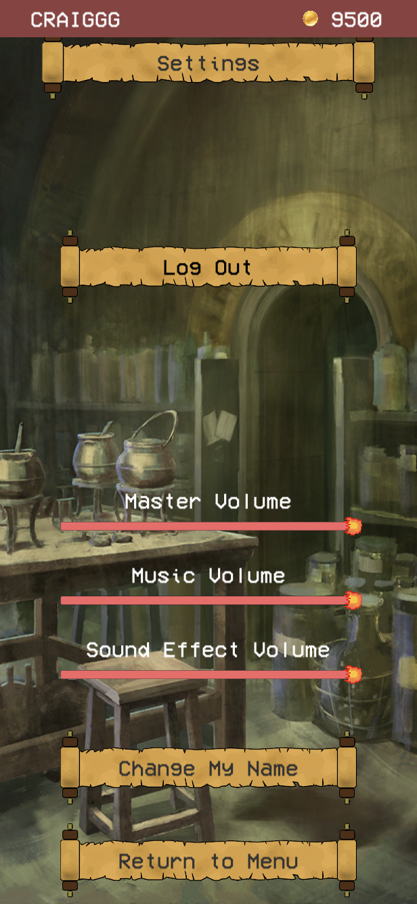

# tsbr-pun

This is a (sadly, largely locally-developed) typing speed battle royale in unity, using Photon networking for matchmaking. I've discontinued work on this, but it runs fine and will fill in your matches with bots if there's not enough human players. 

The core game loop is that you have a queue of words. Typing a word successfully removes the word from your queue and puts it at the end of another player's. Mis-typing adds two more words to your queue and deletes the current word. If your queue reaches 20 words, you lose. The last player standign wins.

Ideally we'd have mechanics such that it's not as deterministically based on skill as it currently is; right now the only balance is if the best player randomly gets attacked a lot.

Users have a persistent account stored in firebase and locally, which syncing on transactions with the remote server taking precedence on conflict. Users authenticate via firebase, so they can login across multiple devices.

Networking is peer-to-peer, with a handoff if the room host fails to send an update tick after a given time window. Lobbies are formed as players queue, and if a lobby is empty for a certain time period the owner triggers bot generation to generate fake players.

There's a few major themes of the project setup
- Setting up custom character models/animations. Thisis hhandled in prefabs (in resources) and in the Character.cs/CharacterSet.cs files in Scripts/Data Types
- Setting up "word lists" or the vocabulary that the player types/sends to other players in the battle royale. Handled in WordList.cs, WordListSet.cs and Word.cs
- Managing lobby/connection state, handled in PlayerManager.cs and BotManager.cs
- Handling postgame data, etc. in MatchData.cs
- Scenescripts handles thhe scenes involved in the UI
  - Character Selection
  - "Library"/word selection
  - New user flow
  - Settings page
  - Lobby/Main Menu
  - Ingame view
  - Postgame view
  
Preview screenshots (unity editor, pardon the inconsistent resolutions):

